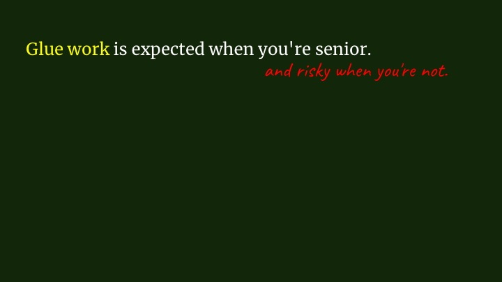
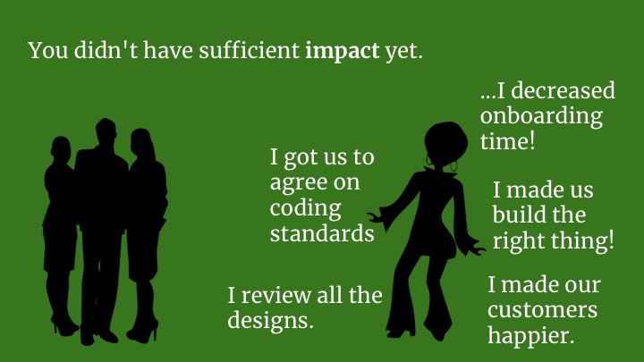
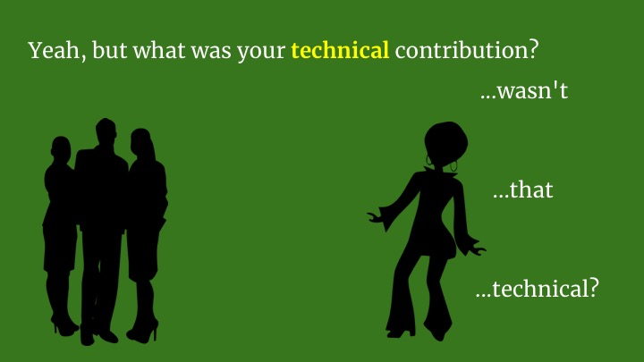
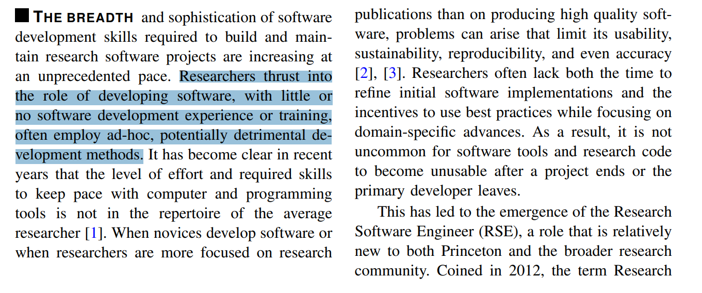
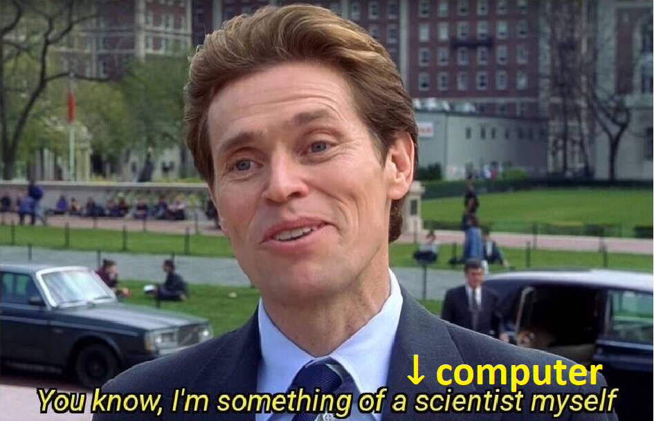
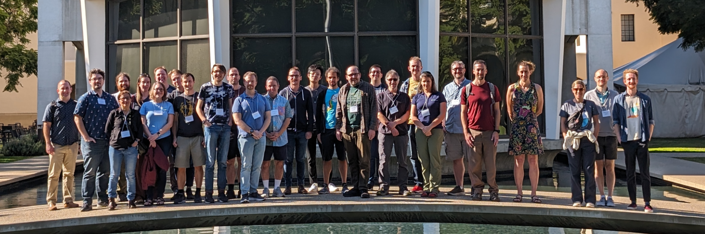
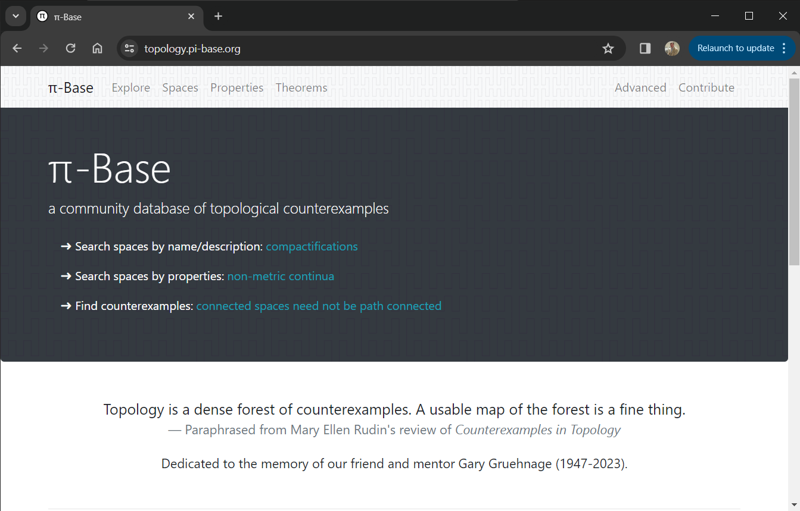
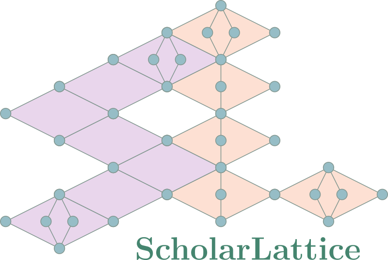

# **Sociotechnical infrastructure for mathematics research**

**Steven Clontz**

University of South Alabama

---

# Abstract

The National Science Foundation defines "cyberinfrastructure" (or "sociotechnical infrastructure") as "the hardware, software, networks, data and people that underpin today's advanced computing technology", particularly technologies that advance scientific discovery. In mathematics research, even theoretical mathematics, we use many technologies, and engage with many different communities, but there is little scholarship on the ad hoc research infrastructure itself that we implicitly rely on from day to day.

---

## "Glue Work" 

*Being Glue* by Tanya Riley [[1](https://noidea.dog/glue)]. See also [[2](https://www.aeaweb.org/articles?id=10.1257/aer.20141734)], [[3](https://vimeo.com/showcase/10835829/video/894303648)].

---

## "Glue Work" 

*Being Glue* by Tanya Riley [[1](https://noidea.dog/glue)]. See also [[2](https://www.aeaweb.org/articles?id=10.1257/aer.20141734)], [[3](https://vimeo.com/showcase/10835829/video/894303648)].

---

## "Glue Work" 

*Being Glue* by Tanya Riley [[1](https://noidea.dog/glue)]. See also [[2](https://www.aeaweb.org/articles?id=10.1257/aer.20141734)], [[3](https://vimeo.com/showcase/10835829/video/894303648)].

---

# <!-- fit --> What are the  "technical  contributions"  in mathematics?

---

# <!-- fit --> What is our  "glue work"? &nbsp;

---

## A particular type of glue: math research infrastructure

- Conferences/workshops/seminars
- Journals (websites, submission management)
- Forums (MathOverflow, nLab)
- Software (SageMath, R, Python)
- Databases (LMFDB, OEIS, $\pi$-Base)
- Formalized math (Lean, Coq)
- Documents (LaTeX, Markdown, PreTeXt)

---

# <!-- fit --> In math, highly technical  cyberinfrastructure work  is glue.

---

## Who writes research software in general?

- [The United States Research Software Engineer Association (US-RSE)](https://us-rse.org/)

- [An RSE Group Model: Operational and
Organizational Approaches From Princeton University’s
Central Research Software Engineering Group](https://arxiv.org/abs/2210.16261)

---

## Who writes research software in math?

---

## Who writes research software in math?

## <!-- fit--> 🤷

---

## <!--fit --> Future work: formal survey of math research  software engineers (identity, practices)

---

## Last December: AIM Workshop on Cyberinfrastructure

Participants came from several different backgrounds: established mathematicians, young researchers, educators, industry software developers. [[link](https://aimath.org/pastworkshops/cyberinfrastructure.html)]

---

## Working groups

- Formal Math Interoperability with CAS
- Databases of Visualizations
- Database of Databases
- Canonical Concepts and Alignment
- Knowledge Tracing
- Developer On-Ramps
- Community Values
- Math in the Future

---

## One outcome

# <!--fit -->[`code4math.org`](https://code4math.org)

- Consortium Of Digital Ecosystems 4 MATHematics

- Today: a Zulip chat. Tomorrow: ???

---

## My cyberinfrastructure work

Before tenure: hobby

Post tenure: *scholarship* ✨✨ (in my heart at least)

Two in particular:

- $\pi$-Base
- ScholarLattice

---

## $\pi$-Base

<https://topology.pi-base.org>

---

## ScholarLattice

<https://scholarlattice.org>

---

# <!--fit--> Thanks!

# <!--fit--> Questions?&nbsp;&nbsp;&nbsp;&nbsp;&nbsp;&nbsp;&nbsp;&nbsp;&nbsp;&nbsp;&nbsp;

